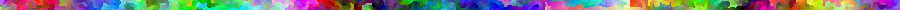
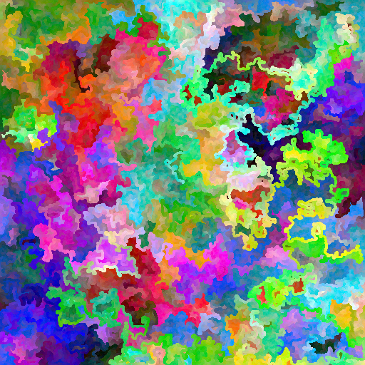
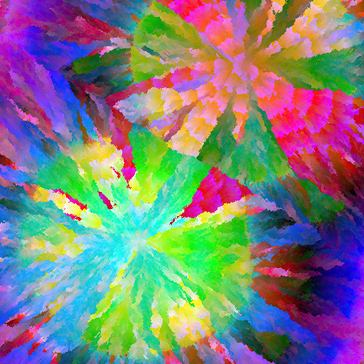
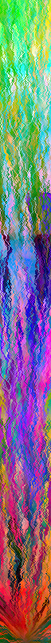

# Omnichroma

Omnichroma is an image generator in javascript inspired by the ["Images with all colors" code golf challenge](https://codegolf.stackexchange.com/questions/22144/images-with-all-colors).
It generates images where each pixel is a different color.

You can play around with it [here](https://sophmrs.github.io/omnichroma).

